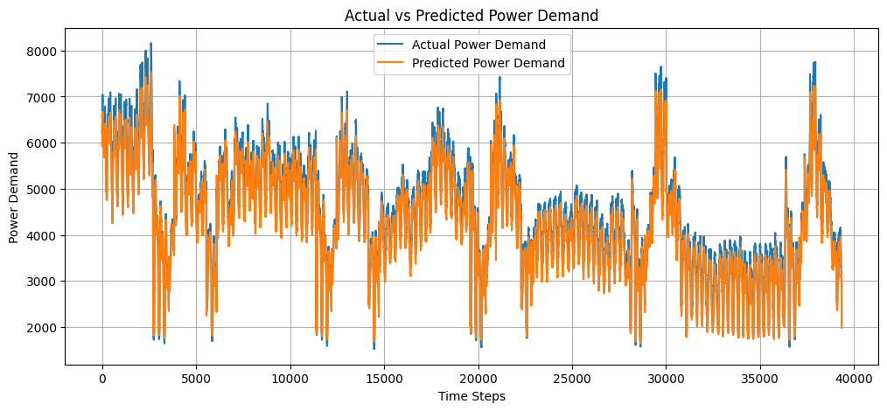
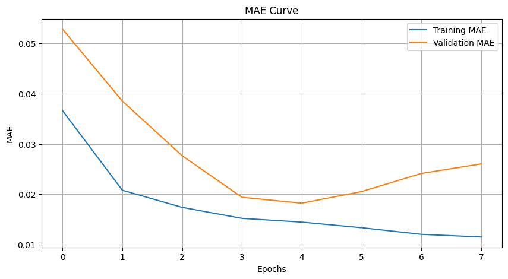
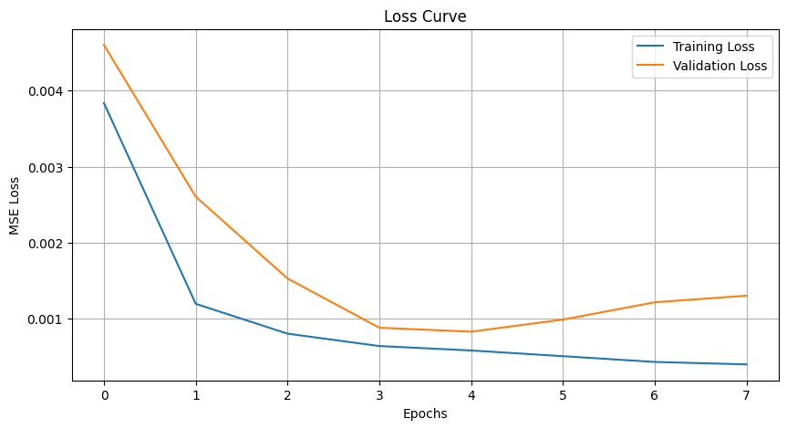
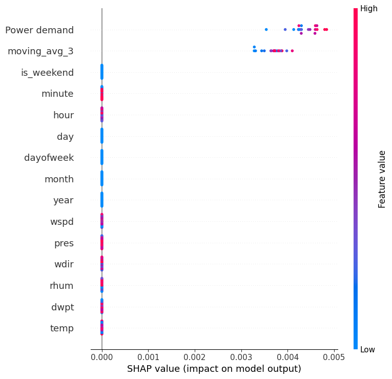

# Power Demand Forecasting using LSTM

## Overview
This project focuses on short-term electricity demand forecasting using Long Short-Term Memory (LSTM) networks. The model predicts future power demand based on historical load data and time-based patterns.

## Problem Statement
Accurate short-term electricity demand forecasting is essential for efficient grid management. This project aims to reduce forecasting errors and improve decision-making for energy distribution systems.

## Notebook

Due to GitHub rendering limitations, the notebook may not preview correctly.

Download and open locally to view full results:
[lstm_power_forecasting.ipynb](./lstm_power_forecasting.ipynb)

## Results

### Prediction vs Actual

### Training Performance (MAE Curve)

### Additional Performance View

### Model Interpretation (SHAP)

## Methodology

### Data Processing
- Conversion of timestamp data into structured datetime features
- Handling missing values using interpolation
- Feature engineering using:
  - Hour, day, month
  - Day of week and weekend indicators
  - Rolling mean and statistical features

### Model Architecture
- LSTM-based neural network for time series forecasting
- Sliding window approach for sequence generation
- Multiple LSTM layers followed by dense output layer

### Training
- Optimizer: Adam
- Loss Function: Mean Squared Error (MSE)
- Train-validation-test split: 80-10-10
- Early stopping used to prevent overfitting

### Evaluation Metrics
- Root Mean Squared Error (RMSE)
- Mean Absolute Error (MAE)
- Mean Absolute Percentage Error (MAPE)

## Features
- Captures temporal dependencies in time series data
- Incorporates feature engineering for improved performance
- Supports explainability using SHAP analysis
- Designed for potential real-time deployment

## Tech Stack
- Python
- NumPy, Pandas
- TensorFlow / Keras
- Matplotlib, Seaborn

- ## How to Run
1. Install dependencies:
   pip install -r requirements.txt

2. Run the notebook:
   Open Project_EST_LSTM.ipynb in Jupyter or Colab

## Applications
- Smart grid optimization
- Load forecasting for power systems
- Energy consumption analysis
- Demand-based energy planning
